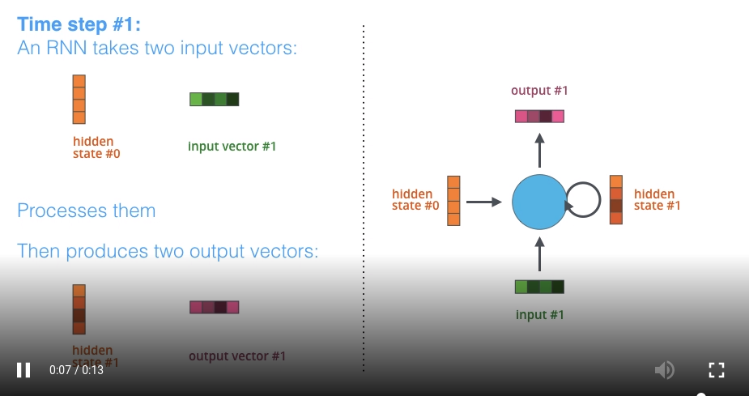
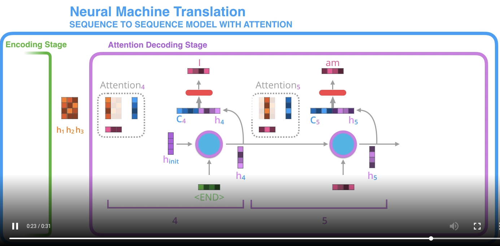
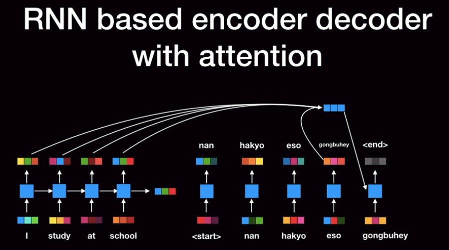
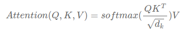
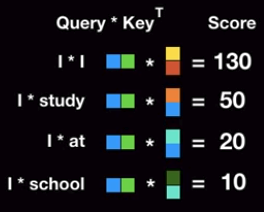
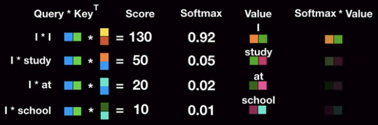
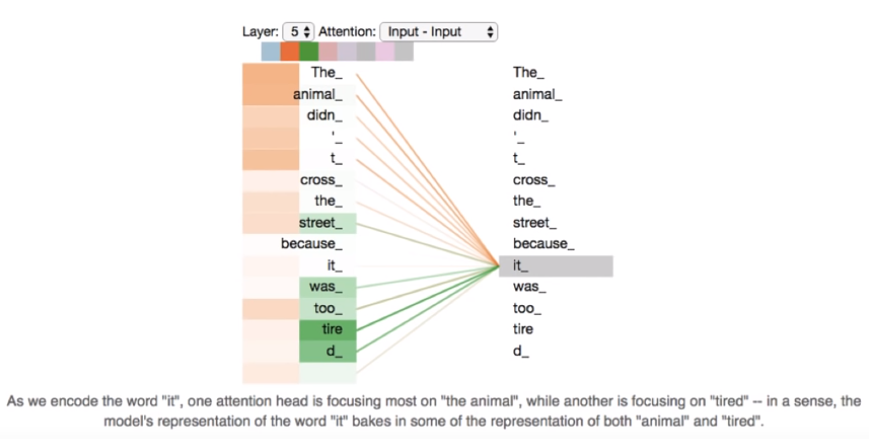
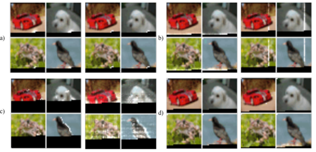
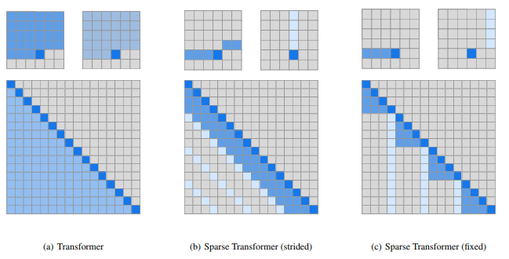

### TransformerS

*References*
http://colah.github.io/posts/2015-08-Understanding-LSTMs/
http://jalammar.github.io/illustrated-transformer/
https://www.youtube.com/watch?v=mxGCEWOxfe8&t=480s

#### 1. RNN

Seq2seq 모델의 가장 베이직한 아이디어. t번째에 대한 output을 생성하기 위해 t번째 해당 input과 t-1번째 hidden state를 사용하여 문장의 순차적 특성을 유지한다는 아이디어이다.

동영상 링크 https://jalammar.github.io/images/RNN_1.mp4

기존 Input - Output 구조에서 hidden state 가 추가되어 동작하는데, 이 hidden state 는 간단하게 말하자면 '메모리 벡터' 라고 할 수 있고, 인간으로 치자면 기억을 담당하는 뇌의 한부분이라고 할 수 있겠다. 이 hidden state 는 처음엔 initialized vector, 즉 뇌가 빈 상태로 시작하여 인풋 아웃풋 계산을 거칠 때마다 방금 한 계산을 벡터의 형태로 기억하게 된다.

동영상 링크 https://jalammar.github.io/images/attention_tensor_dance.mp4

인코더에서 계산된 hidden state들은 concat 된 형태로 decoder에게 전달되고 디코더는 순서에 맞는 state들을 하나씩 뽑아 자신의 hidden state와 함께 output을 연산하고, 그 과정에서 나온 이 노드의 hidden state를 다시 다음 노드에 전달한다. 이 때 주목할 점은 디코더에서의 input은 이전 결과의 output이 된다는 점이다. 

#### 2. Attention Mechanism

위와 같은 RNN 구조의 가장 큰 한계점이 바로 <u>Long-Term dependency</u> 문제 였다. 한마디로 전달되는 뇌(hidden state)의 기억력이 딸렸다. 사실 알다시피 제네럴한 딥러닝 모델에서 대부분 사용하는 gradient descent는 본래 vanishing gradient problem을 가지고 있다. RNN에서는 이 현상이 문장이 길어질수록 앞의 내용을 잊어버리는 것처럼 나타나게 된 것이다.

이에 등장한 메커니즘이 바로 그 유명한 attention 기법이다. 이전의 베이직한 RNN 모델은 Encoder가 먼저 순차적으로 문장을 읽어가며 하나의 뇌를 전달해나갔으나 이 뇌의 용량이 부족하다는 문제가 있었다. 그렇다면, 뇌를 여러개 만들자! 이번에는 encoder가 단어를 읽는 족족 추출한 feature를 decoder에 전달한다. 이로 인해 Long-term dependency 문제가 많이 해소될 수 있었으나, 이게 attention이라는 단어와는 잘 안 맞는다는 생각이 들지 않나...? attention이라면 주목을 해야 하는데... 이건 주목이라기 보단 동적으로 feature extraction & generation 하는 과정으로 보인다. 만약 이런 의문이 들었다면 정상이다. 조금 더 뒤에 진짜 attention의 의미를 제대로 보여주는 모델이 나온다. 

#### 3. LSTM(Long Short-term Memory)

어텐션 기법 다음으로 제안된 모델은 대략 기존 RNN 구조를 기반으로 하되, hidden state를 조금 더 복잡한 cell state 의 형태로 발전 시킨 모델이다. 이 모델은 크게 세가지 스텝으로 진행된다. 
**(1) Forget gate**

먼저 현재 Cell-state 값을 업데이트 하기 위해 forget gate와 input gate를 각각 따로 거친다. 

 forget gate의 수식은 위와 같다. 이전 Cell의 아웃풋(h_t-1)과 현재 인풋(x_t)를 forget layer의 Weight 및 bias 를 거쳐 시그모이드에 의해 0과 1 사이의 확률값으로 표현된다. 이렇게 표현된 값은 이전 아웃풋과 현재 인풋을 보고, 이전의 정보를 얼만큼 잊을 것인가? 를 정의한다고 볼 수 있다. 따라서 이 값은 이전 Cell state(C_t-1)과 연산한다. 

**(2) Cell-state 업데이트**

이제 현재 Cell-state를 실질적으로 업데이트 하자. 먼저 이전 아웃풋과 현재 인풋의 가중치 연산에 따라 얼마나 정보를 업데이트 할 것인지 확률값으로 나타내고(i_t), 또 다른 가중치 연산을 tanh 하여 -1 ~ 1 의 값으로 표현한 현재 Cell state의 추정치(C_t)를 구한다. 말로 설명하는 것보다 위의 수식을 보면 이해가 더 빠를 것이다. 

마지막으로 앞서 계산한 f_t 와 이전 Cell state 값을 연산하여 이전 정보를 어느 정도 담고, 현재 추정되는 Cell state의 값을 i_t를 통해 어느 정도 담아 현재 Cell-state값을 완성한다.

**(3) Output 도출**

현재의 Cell state 를 구했다면 이제 아웃풋 값을 계산할 수 있다. 전과 비슷한 과정으로 아웃풋이 계산된다. 수식 참고.

*참고로 x 부호는  Hadamard product 연산이다.*

(matrix 연산부까지 구현한 코드들)

https://gist.github.com/karpathy/d4dee566867f8291f086

https://ratsgo.github.io/natural%20language%20processing/2017/03/09/rnnlstm/

#### 4. GRU(Gated Recurrent Unit)

LSTM의 발전된 형태로, 성능은 유지하면서 계산량을 확 줄인 셀 구조이다. 기존 존재하던 forget, input, output gate를 update gate 와 reset gate로 변형하였다. 불필요한 계산을 줄이고 조금 더 컴팩트해진 LSTM 모델이다.

자세한 구조는 아래 링크 참고.

https://ratsgo.github.io/deep%20learning/2017/05/13/GRU/

#### 5. Transformer 

위와 같은  LSTM, GRU 라는 개선에도 불구하고 이들은 모두 RNN 기반 구조였기에 Long-term dependency를 완전히 탈출하지는 못했다. 이러한 한계점을 타개해준 논문이 바로 그 유명한 'Attention is all you need' 이다. 어텐션이 어텐션 받고 있는 만큼 딥러닝에 관심 있다면 반드시 한번쯤 읽어보는 것이 좋다. 이 논문은 제목 그대로, 기존 RNN 기반 모델들을 아예 사용하지 않고 attention 기법만을 적용해도 sequence 모델을 다루는 데 손색이 없고 심지어 더 좋은 성능과 결과를 보인다는 내용이다. 

아이디어는 대략 이렇다. 문장에서 중요한 부분만 기억하며 순차적으로 읽어나가는 것이 아니라, 병렬화(Parallelization)을 통해 한 방에 문장을 위에서 관조하자! 전체 문장에서 주목해야할 부분에 가중치를 높이는 방식이기 때문에 어떠한 정보를 잊어버릴 일이 없다. 즉, Long-term dependency를 완벽히 극복해낸 것이다. 이 논문에서 제시한 모델이 바로 transformer 이고 이것은 여러 분야에 응용되며 다양한 분야의 state-of-the-art 자리에 앉게 되었다.  

- **Overview**
  

  인코더에서는 각 input의 포지션에 대해, 즉 각 단어에 대한 attention을 처리하여 새로운 representation인 Z 벡터로 변환한다. 디코더에서는 이 Z를 받아 output sequence를 순차적으로 생성한다. 이렇게 보면 정말 간단해 보이지만 자세하게 보면 꽤 복잡하다. 하나하나 차근차근 보자.

* **Ideas**

  **(1) Positional Encoding**
  문장에서 어떤 단어의 위치 정보는 매우 중요하다. 이 위치 정보를 뒷받침 해주던 RNN 을 아예 없앴는데, 이 위치 특성은 어떻게 해야 하나? 라는 질문의 해결책으로 제안되었다.

  * -1 ~ 1 사이의 값
  * cos, sine 함수 사용
  * 자세한 내용은 논문 참고

  

  **(2) Self Attention**

  

  attention 에 대한 직관을 잘 보여주는 그림. 예시 문장에서 it 이라는 단어를  해석하기 위해서는 앞에서 언급되었던 the animal 이라는 단어에 주목해야 할 것이다.  각 단어마다 상응하는 attention 정보를 벡터로 가지고 있다. 이걸 어떻게 하느냐? 논문에서는 attention 연산을 Scaled dot-product attention 이라 표현한다.

  

  

  Q는 query vector를, K는 key vector를, V는 Value vector를 의미한다. dk는 input의 디멘션을 의미한다. 여기서 요 벡터들이 갑자기 왜 나와서 이러는 지 혼란스러울텐데... 이 친구들은 한마디로 attention을 구현하기 위해 필요한 몇가지 역할들을 각각 담당하는 벡터들이라고 생각하면 된다. 

  **(필요한 몇가지 역할?)** Query 벡터는 말 그대로 현재 쿼리 단어를 뜻하고, 여기에 첫번째로 곱해지는 Key 벡터는 어떤 단어와의 상관 관계 정보를 담고 있다고 생각할 수 있다. 이 둘을 matmul 했을 때 나오는 결과를 Score라고 부르는데, 이 값이 높으면 두 단어의 연관성이 높음을 뜻한다(and vice versa).
  
  

  이후 이 스코어 값을 0과 1사이의 확률값으로 표현하기 위해 softmax function을 취해주는데 이 때 Key 벡터의 루트값으로 먼저 score를 나눠준다. 논문에서는 key 벡터의 차원이 커질수록 스코어 계산값이 증대하는 문제를 보완하기 위해 추가한 연산이라고 한다. 

  여튼 이렇게 계산된 확률 값들을 Value 벡터와 다시 곱해준다. 이 Value 벡터는 앞서 나온 Key 벡터와 pair 즉 한 쌍을 이루고 있는 것으로 **현재 내가 이해하기론 기존 워드 임베딩과 같은 존재 같다.** 따라서, Softmax값을 Value 벡터와 곱하는 이유는 내가 현재 보고 있는 이 단어와 가장 유의미한 관계를 가지고 있는 단어 임베딩을 가장 선명하게, 별 상관없는 단어의 임베딩은 아주 희미하게 남기겠다는 뜻이다. 마지막으로 요 값들을 모두 시그마한  것이 Attention layer를 거친 어떤 단어 A의 최종 output이 된다. 이는 문장 속의 어떤 단어 A가 가진 의미, 중요성, 즉 우리가 기존 attention 기법에서 사용한 hidden layer와 비슷한 시맨틱이라고 보면 된다.
  
  

  하지만 이해될 때만 이해되고 또 뒤돌아 보면 이해가 안될 수 있으니 마지막으로 한번만 더 정리해보자. Q와 K를 Dot product한 후 루트 dk로 스케일링하는 과정에 의해 둘 사이의 유사도를 구한 뒤(이 과정은 cosine similarity와 유사) 이 유사도를 전체 문장에 대해 softmax를 취해 확률값으로 나타낸다. 이 값을 Value 벡터와 dot-product 함으로써 query 와 유사한 value일수록, 중요한 value일 수록 결과 값이 높아진다. 즉, 현재 단어의 output에 그 단어와 가장 연관 높은 단어들의  Value 벡터들을 가장 많이 포함시키려는 과정이다.(softmax 연산을 왜 집어넣었는 지 직관적으로 이해할 수 있다.)

  

  **(3) Multi Head Attention**
  
  한번에 여러개의 attention 쓰레드를 내리는 것. 왜 좋을까? 어떤 문장의 단어는 2~3개의 단어와 밀접한 연관을 가지고 있을 수 있고, 또는 모호한 애매한 관계를 가지고 있는 단어들 역시 처리할 수 있다. 

  > Multi-head attention allows the model to jointly attend to information from different representation subspaces at different positions

* **전체 Process**

  

  

  

  

  [코드](http://nlp.seas.harvard.edu/2018/04/03/attention.html) | [논문](https://arxiv.org/pdf/1706.03762.pdf)

  

  (+) 이 논문이 발표된 2017년 이후로 지금까지 모델에 많은 발전 및 변화가 있었다. 따라서 논문의 설명과 최신까지 개정되어온 실제 코드 사이의 차이가 조금 있다. 그 디테일을 확인하기 위한 좋은 링크.

  **Details Not Described in the paper** https://tunz.kr/post/4

* **Layer Details**

1. Encoder Layer
   * Positional Encoding 이 Back prop때 vanishing 되는 현상을 방지하기 위해 Residual Block 기법을 사용하여 Positional 정보를 전달.
   * Multi-head Attention 레이어의 결과를 모두 concat한 후 또 다른 weight matrix와 연산하여 input과 동일한 쉐잎으로 변형. 
   * 이후 각 행마다(단어마다) fc를 거치고 이때 역시 residual block 기법 사용. 최종 output은 input의 쉐잎, 즉 차원과 동일하다
   * Normalization 당연잇음
   * 여기서 중요한 건 output이 input의 차원과 동일하다고 했는데, 그렇기에 encoder를 여러개 이어붙일 수 있게 됨. 그러나, 각각의 encoder들은 weight를 서로 공유하지 않음
   * 실제 논문의 Transformer 모델은 6개의 인코더를 이어붙였음
2. Decoder Layer
   * Masked Multi head Attention: ??? 이건 모르겠다
   * Multi-head Attention: 현재 디코더 노드의 출력 값을 Query 벡터로 사용하고 인코더에서 Key 와 Value 벡터를 가져와서 연산함.
   * 인코더와 동일하게 residual block
   * 마지막에 Linear 로 피고 Softmax
   * Label Smoothing -> One-hot encoding을 대체한 기법. 너무 학습 데이터에 치중하게 되는 경우 방지하기 위하여 1,0 대신 0부터 1사이의 값으로 부드럽게 펴줌. 0.0001, 0.9, 0.0001 .... 이렇게. (이게 답이긴 한데 저럴 수도 있다)

#### 4. Sparse Transform

이렇게 Attention is all you need에서 쏘아올린 트랜스포머는 Elmo, Bert 와 같은 모델로 거듭나며 여러 분야의 모델에 대체제로 사용되었고 온갖 state-of-the-art란 art는 다 쓸어담은 게 지난 2017 ~2018년간의 상황이었다. 여전히 attention은 핫하고, 트랜스포머도 핫하다. 이런 시점에서 올해(2019년) 4월 따끈따끈한 논문이 하나 발표되었다. [Generating Long Sequences with Sparse Transformers](https://arxiv.org/pdf/1904.10509.pdf) 은 OpenAI에서 발표한 논문으로 기존 transformer를 컴팩트하게 발전시킨 Sparse Transformer 모델을 소개한다. 

기존 트랜스포머 모델은 시퀀스 길이가 증가하면 증가할수록 메모리 및 계산필요량이 증대한다는 문제가 있었다. 논문은 이를 보완하여 불필요한 계산을 줄이고 압축하거나 recomputation을 통해 메모리 사용량을 줄일 수 있는 방법론을 제시하였고, 추가적으로 residual block과 weight initialization을 재구성하여 결론적으로 매우 딥한 네트워크에 대한 트랜스포머 트레이닝을 상당히 개선시켰다. (Traditional T는 O(n^2 d) 인 반면 Sparse T 는 O(n sqrt(n))) 

그럼 어떻게 했을까? 논문은 다음 세가지를 메인 아이디어로 제시한다.

>1. A faster implementation of normal attention (the upper triangle is not computed, and many operations are fused).
>2. An implementation of "strided" and "fixed" attention, as in the Sparse Transformers paper.
>3. A simple recompute decorator, which can be adapted for usage with attention.

~~멍게소리...~~

**(1) Attention Learning Pattern**

논문 팀은 Transformer의 어텐션 기법이 어떤 패턴으로 학습 되고 있는 지 먼저 연구했다. 실험은 이렇다. 128 레이어의 traditional transformer가 CIFAR-10 데이터셋을 학습하는 과정의 깊이 별로, 다음 pixel을 생성할 때 가장 attention D웨이트가 높은(=가장 주목하고 있는) pixel이 어디인 지 확인하기 위해 해당 pixel들을 밝게 표현한다. 그림 a,b,c,d 는 순서대로 레이어가 깊어질수록 트랜스포머가 특정 픽셀을 생성해낼 때 attention을 강하게 주는 픽셀들을 밝게(하얗게) 나타내는 그림이다. 레이어 초반부에는 a에서 보다시피 horizontal하게 현재 생성하는 pixel의 주변부만 어텐션 하고 있는 반면그림 b의 레이어 19와 20에서는 vertically 하게 어텐션 하고 있음을 알 수 있다. 그림 c의 20 ~ 64 사이의 레이어에서는 row와 column 레벨을 벗어나 global data dependent 하게 학습 패턴이 잡혀진 것을 볼 수 있고, 64 레이어 이후부터는 전체 이미지에서 굉장히 적은 양의 픽셀들만을 주목하고 있음을 볼 수 있다(사진에서는 잘 안 보인다). 이 그림을 아주 잘 표현한 움직이는 이미지가 [openai 공식 블로그 포스트](https://openai.com/blog/sparse-transformer/) 에 있다.

오오 신기하다. 이들은 이렇게 기존 트랜스포머가 무언가를 학습하는 데 있어서 특정 패턴을 보인다는 것, 특히 결국엔 적은 양의 sparse한 데이터에만 attention을 주고 있음에 주목했고, 그렇다면 그냥 처음부터 sparse하게 학습해도 되지 않을까? 라는 아이디어를 내게 되었다.  

**(2) Strided & Fixed** 

(a)는 나 이전의 모든 데이터에 대해 연산하는 기존 Transformer, (b), (c)는 Sparse Transformer에서 제안하는 두가지 축소된 attention 기법이다. 집에 가야돼서 이 부분부터는 다음주에.... 

