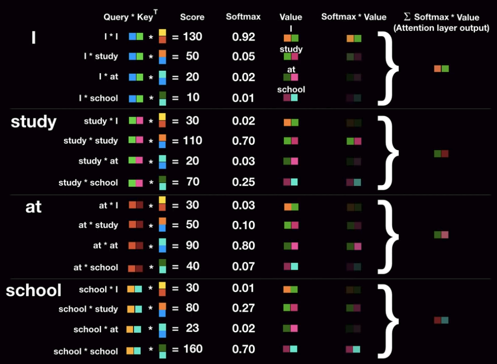
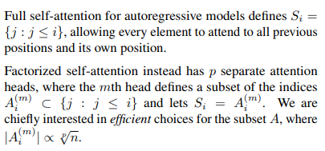
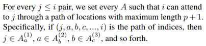

### 순차적 데이터를 다루는 딥러닝 모델들 - 1

Recurrent Neural Networks, 줄여서 RNN이라 불리는 모델들을 소개하겠습니다. 

***

##### Introduction

RNN은 기본적으로 순차적 정보를 가지는 sequential data(ex. time-series data) 를 효과적으로 학습하기 위해 고안된 모델이다. 데이터의 종류를 구분하는 방법은 여러가지가 있지만, 아주 간단하게는 many OR one 으로 구분할 수 있다. 앞서 말했듯이 RNN은 순차 정보를 처리하도록 고안된 모델이므로 하나의 인스턴스당 적어도 2개 이상의 데이터를 가진 many 데이터를 input 또는 output으로 가지게 된다. 따라서 RNN은 총 4가지의 경우 중 one to one을 제외한 다음과 같은 3가지의 경우에 관심이 있다.

*[Figure 0] Sequential data and RNN - ref [ratsgo's blog]([https://ratsgo.github.io/natural%20language%20processing/2017/03/09/rnnlstm/](https://ratsgo.github.io/natural language processing/2017/03/09/rnnlstm/))*

*위와 같이 RNN이 풀 수 있는 문제는 다양하지만, 보통 많은 블로거들은 설명의 편의상 텍스트 데이터를 예로 드는 편이다.*

##### Short History

사실 기본 RNN 아이디어 자체는 1980년대 등장하여 근 30년간 조용히 연구되던 분야이다. 기본 RNN을 계승하여 attention 기법, LSTM, GRU 등의 모델들이 차례로 등장하였고, 이 모델들의 성과는 그 당시 꽤 만족스러웠기에 Sequential data 하면 RNN을 통상적으로 사용해왔다. 특히 자연어 및 비디오 데이터와 같이 기본이 순차적 데이터인 경우는 RNN 계열 모델을 사용하는 것이 당연했다(딱히 다른 대안도 없었던 것 같다).  그러나 이 모델들은 후에 설명할 **Long-term dependency problem**를 극복하지 못해 비교적 암흑기를 지나고 있었다. 이런 암흑기가 끝나려는 태동이 시작된 것은 지난 2015년 즈음부터라고 할 수 있다.

> Then in the following years (2015–16) came [ResNet](https://arxiv.org/abs/1512.03385?source=post_page---------------------------) and [Attention](https://arxiv.org/abs/1502.03044?source=post_page---------------------------). One could then better understand that LSTM were a clever bypass technique. Also attention showed that MLP network could be replaced by *averaging*networks influenced by a *context vector*.
>
> *Reference* - 'The fall of RNN and LSTM', 2018, Eugenio Culurciello

그리고 지난 2018년 9월에 'Attention is all you need' 라는 제목의 논문이 게재되었다. 논문은 기존 RNN 기반 알고리즘을 완전히 탈피하고, sequential data를 처리할 수 있는 새로운 모델 - Transformer를 제안했다. 물론 그 이전에도 attention 기법을 기존 모델에 적용하려는 시도 및 성과는 분명 있었으나, RNN과 LSTM의 틀을 벗어나지는 못했었다. 논문은 그 상식을 깨고, 제목처럼 attention'만' 써도 순차 정보를 처리하기에 충분하며 심지어 더 좋기까지 하다는 내용을 발표한 것이다. 뿐만 아니라 이들이 소개한Transformer는 기존 SOTA를 월등한 차이로 이기며 대부분의 NLP task의 1위 자리에 우뚝 서게 되었다. 물론 1년 사이에 transformer를 응용한 모델들이 몇번씩이나 갈아치워졌긴 하지만.. 여하튼 개인적 의견 으로는 이 논문을 기점으로, NLP 분야의 암흑기가 끝난 것으로 모자라 황금기가 시작되었다고 말할 수 있을 것 같다. Transformer가 대체 뭐길래 이렇게 핫한건지, 기존의 어떤 문제를 해결한건지, 현재 연구 방향은 어떠한지 알아보자.

#### 1. RNN

RNN의 기본 아이디어는 이렇다 -> n번째에 대한 output #n 을 생성하기 위해, 그에 상응하는 input #n 과 추가적으로 n-1번째 hidden state #n-1 를 전달하여 문장의 순차적 특성을 활용 및 보존한다.

*[Figure 1.1] RNN basic architecture*

위는 RNN의 기본 구조를 잘 표현한 그림으로, 괜히 사람 헷갈리게 아웃풋을 h라고 표시하고 hidden layer를 A라고 표시해놨다. (+) 여기서 A로 표현되는 저 층을 hidden layer라 하고 각각의 초록 박스는 RNN cell 이라 부른다. 동작 방식은 대략  Input data의 순서대로,

**input x_n을 n번째 cell에 입력 -> **
**input x_n & hidden state_n-1 을 cell 가중치에 곱하여 예측 값인 output h_n 을 출력 -> **
**hidden state_n 을 다음 n+1번째 cell에 전달 -> input x_n+1을 n+1번째 cell에 입력 -> **
**...반복... 입력 시퀀스가 끝날 때까지**

보다시피 순차적인 input-output 방식에 hidden state라는 벡터가 추가되어 동작하는데, 이 hidden state 는 한마디로 '메모리 벡터' 와 같은 존재이다. 인간으로 치자면 기억을 담당하는 뇌의 한부분이라고 할 수 있겠다. 이 hidden state 는 처음엔 initialized vector 즉 뇌가 빈 상태로 시작되고 그 후 순차적으로 Input -> Output 계산을 해나갈 때 차례차례 전달되는데, 이때 방금 한 연산을 벡터의 형태로 저장하여 다음 연산시 함께 계산된다. 어떠한 n번째 input에게 이전 input(0부터 n-1번째)들의 정보를 전달하기 위함이다. 

* Forward
  

  *[Figure 1.2] RNN Forwarding Example - ref [karpathy's blog]([http://karpathy.github.io/2015/05/21/rnn-effectiveness/?source=post_page---------------------------))*

  Forwarding 하는 과정을 조금 더 자세히 보자. 위 그림은 'hell' 이라는 순차문자열을 input으로 하였을 때, 다음에 나올 문자를 'o' 라고 예측하는 예시이다. 각각의 문자를 one hot encoding으로 표현한 후 첫번째 순서인 'h' 를 첫번째 cell에 푸쉬하고 hidden layer의 연산을 통해 다음에 나올만한 문자를 확률 값으로 나타낸다. 보면 마지막 행인 'o' 4.1로 가장 확률이 높지만 사실 답은 2번째 초록 글씨로 볼드처리된 'e'인 것을 알 수 있다. 그러니 초록글씨 행은 강화되고 빨간 글씨 행들은 약화되도록 학습시킬 것이다. 두번째 문자인 'e'도 같은 방식으로 연산된 후 'o'를 1.2의 확률로 가장 높게 예측했다. ~~틀렸다.~~  이번 cell도 첫번째 했던 것과 똑같은 방식으로 학습 시킬 것이다. 하지만 이번부터는 hidden layer가 동작하고 있음을 주목해야 한다. 이번에 예측된 'o'는 앞서 계산하였던 'h'에 대한 정보를 전달 받아 input 인 'e' 와 함께 연산된 결과이다. ~~물론 틀리긴 했지만~~ 또한 이번 cell 역시 지난 과거의 정보와(h) 새롭게 추가된 정보(e)를 연산하여 hidden layer의 차원에 담은 후 다음 cell에 전달하게 된다. 그럼 다음 cell은 다음 input인 'l' 과, 전달 받은 과거의 정보(h, e)가 담긴 hidden state를 함께 연산하여 다음 문자를 예측하는 것이다. 세번째는 잘 맞췄다. 이제 마지막, 실제 정답인 'o'를 예측해야 하는 마지막 cell 에게 각각 상응하는 가중치와 연산된 hidden state, input을 입력 받고 다음 나올 문자를 예측한다.

  이것이 RNN 모델이 동작하는 방식이다. 보통, 실제 input인 'hell' 에 대해 진행한 세 번의 연산은 encoder라 하고, 마지막 실제 알고자 하는 결과에 대한 연산을 decoder라 한다. 이 예제는 many to one이기에 매우 간단해 보이는데, 만약 many to many 모델이면 실제 인풋이 끝나는 지점에서 hidden state에 가중치 W_hh를 곱해준다. 또한 decoder에서 input 대신(input이 없으니까) 바로 이전 cell의 output을 input으로 사용한다. 

  

  *[Figure 1.3] RNN many to many architecture - ref [this medium post](https://mc.ai/understanding-the-rnn-attention-model/)*

* 역전파 과정 및 더 자세한 내용은 아래 블로그들을 참고하면 좋다.
  [RNN- effectiveness, Karpathy blog](http://karpathy.github.io/2015/05/21/rnn-effectiveness/?source=post_page---------------------------)
  [RNN과 LSTM을 이해해보자!, ratsgo's blog](https://ratsgo.github.io/natural language processing/2017/03/09/rnnlstm/)

#### 2. Attention Mechanism

위와 같은 RNN 구조의 가장 큰 한계점은 바로 **Long-Term dependency** 문제다. Long-term dependency는 문장이 길어질수록 비교적 초반부에 입력받은 input에 대한 정보를 손실하게 되는 현상을 말하는데, 한마디로 전달되는 뇌(hidden state)의 기억력이 부족한 것이다. RNN에서 이 문제를 해결하고자 고안된 메커니즘이 attention 기법이다.

*[Figure 2.1] RNN with attention - ref [this medium post](https://mc.ai/understanding-the-rnn-attention-model/)*

> 베이직한 RNN 모델은 Encoder가 먼저 순차적으로 문장을 읽어가며 하나의 뇌를 전달해나갔으나 이 뇌의 용량이 부족하다는 문제가 있다.
>
>  ->그렇다면, 뇌를 여러개 만들자! 

즉, Encoder에서 각 단어마다 연산된 정보를 저장해놓고, Decoder의 각 cell이 자신의 순서에 맞는 정보를, 즉 기억을 하나씩 빼가겠다는 것이다. 다시 말해 각각의 cell마다 자신의 전용 뇌를 하나씩 구비하고 있다고 볼 수 있겠다. 괜찮은 아이디어인 게, 베이직한 RNN 모델에서는 hidden state가 모든 input data를 거친 후 바로 디코더의 시작 cell에 전달되기 때문에 문장의 앞 내용을 많이 잊어버린 상태일 수 밖에 없었다. 그렇기에 위와 같이 각 input에 대한 hidden state를 따로 저장해놓고 그 순서에 맞는 decoder cell에 전달해주는 것 만으로도 성능이 많이 개선될 수 있었다. 이렇게 Long-term dependency 문제가 어느 정도 해소될 수 있었으나, 이게 attention이라는 단어와는 잘 안 맞는다는 생각이 들기도 한다. attention이라면 뭔가 주목을 해야 하는데... 이건 주목이라기 보단 그냥 초반부의 정보를 저장해놓고 활용하는 트릭으로만 보인다. 게다가 기계번역 과정에서도 문제가 있다. 한국어와 영어처럼 문장 구조 순서가 아예 다른 문장은 어떻게 번역할 거란 말인가? 'I ate pasta'라는 입력으로부터 '나는 파스타를 먹었다' 라고 번역 결과를 출력하고 싶은데, '파스타를' 출력해야 할 cell에 pasta라는 정보가 들어오지 않는다. 물론 이 attention을 추가한 RNN 모델이 딱 들어맞는 문제도 있겠지만, 진짜 attention의 의미를 제대로 실현하지는 못했다고 생각한다. ~~Transformer가 진짜배기 attention~~ 

#### 3. LSTM(Long Short-term Memory)

Long-term dependency를 극복하고자 한 또다른 시도는, 전달될 뇌를 쓸거면 좀 효율적으로 쓰자는 아이디어를 바탕으로 고안된 LSTM 모델이다. LSTM은 기존 RNN 구조를 기반으로 하되, hidden state를 조금 더 복잡하지만 똑똑하게 쓸 수 있도록 발전 시킨 모델이다. 이제 hidden state는 무작정 합성곱만 하는 것이 아니라, 기억해야 할 정보와 잊어버려도 될 정보들을 학습하여 최대한 input 데이터의 핵심만 기억하려 한다. 

*[Figure 3.1 ~ 3.5] LSTM Architecture- ref [ratsgo's blog]([https://ratsgo.github.io/natural%20language%20processing/2017/03/09/rnnlstm/](https://ratsgo.github.io/natural language processing/2017/03/09/rnnlstm/))*

전체 흐름은 기본 RNN과 동일하나, 그 작고 간단하던 cell이 좀 커지고 복잡해졌다. Cell state update는 크게 세가지 스텝으로 진행된다. 

* Forward

  **(1) Forget gate**

  먼저 현재 Cell-state 값을 업데이트 하기 위해 forget gate와 input gate를 각각 따로 거친다. 

  

  

   forget gate의 수식은 위와 같다. 이전 Cell의 아웃풋(h_t-1)과 현재 인풋(x_t)를 forget layer의 Weight 및 bias 를 거쳐 시그모이드에 의해 0과 1 사이의 확률값으로 표현된다. 이렇게 표현된 값은 이전 아웃풋과 현재 인풋을 보고, 이전의 정보를 얼만큼 잊을 것인가? 를 정의한다고 볼 수 있다. 따라서 이 값은 이전 Cell state(C_t-1)과 연산한다. 

  **(2) Cell-state 업데이트**

  

  이제 현재 Cell-state를 실질적으로 업데이트 하자. 먼저 이전 아웃풋과 현재 인풋의 가중치 연산에 따라 얼마나 정보를 업데이트 할 것인지 확률값으로 나타내고(i_t), 또 다른 가중치 연산을 tanh 하여 -1 ~ 1 의 값으로 표현한 현재 Cell state의 추정치(C_t)를 구한다. 위의 수식을 보면 이해가 더 빠를 것이다. 

  

  마지막으로 앞서 계산한 f_t 와 이전 Cell state 값을 연산하여 이전 정보를 어느 정도 담고, 현재 추정되는 Cell state의 값을 i_t를 통해 어느 정도 담아 현재 Cell-state값을 완성한다.

  **(3) Output 도출**

  

  현재의 Cell state 를 구했다면 이제 아웃풋 값을 계산할 수 있다. 전과 비슷한 과정으로 아웃풋이 계산된다. 
  *(참고로 그림의 x 부호는  Hadamard product 연산이다)*

* matrix 연산부까지 구현한 코드들
  https://gist.github.com/karpathy/d4dee566867f8291f086
  https://ratsgo.github.io/natural%20language%20processing/2017/03/09/rnnlstm/

#### 4. GRU(Gated Recurrent Unit)

LSTM의 발전된 형태로, 성능은 유지하면서 계산량을 확 줄인 셀 구조이다. 뉴욕대에 계신 조경현 교수님께서 발표하셨다.기존 존재하던 forget, input, output gate를 update gate 와 reset gate로 변형하였다. 간단하게 불필요한 계산을 줄이고 조금 더 컴팩트해진 LSTM 모델이라고 생각할 수 있겠다.

*[Figure 4.1] GRU architecture - ref [ratsgo's blog]([https://ratsgo.github.io/deep%20learning/2017/05/13/GRU/](https://ratsgo.github.io/deep learning/2017/05/13/GRU/))*

자세한 내용은 ratsgo님이 설명을 너무 잘해주셔서 [이 포스트](https://ratsgo.github.io/deep%20learning/2017/05/13/GRU/)를 참고하기를 추천합니다. 

#### 5. Transformer 

위와 같은  LSTM, GRU 라는 개선에도 불구하고 이들은 모두 RNN 기반 구조였기에 Long-term dependency를 완전히 탈출하지는 못했다. 이러한 한계점을 타개해준 논문이 바로 그 유명한 'Attention is all you need' 이다. 어텐션이 어텐션 받고 있는 만큼 딥러닝에 관심 있다면 반드시 한번쯤 읽어보는 것이 좋다. 이 논문은 제목 그대로, 기존 RNN 기반 모델들을 아예 사용하지 않고 attention 기법만을 적용해도 sequence 모델을 다루는 데 손색이 없고 심지어 더 좋은 성능과 결과를 보인다는 내용이다. 

아이디어는 대략 이렇다. 문장에서 중요한 부분만 기억하며 순차적으로 읽어나가는 것이 아니라, 병렬화(Parallelization)을 통해 한 방에 문장을 위에서 관조하자! 전체 문장에서 주목해야할 부분에 가중치를 높이는 방식이기 때문에 어떠한 정보를 잊어버릴 일이 없다. 즉, Long-term dependency를 완벽히 극복해낸 것이다. 이 논문에서 제시한 모델이 바로 transformer 이고 이것은 여러 분야에 응용되며 다양한 분야의 state-of-the-art 자리에 앉게 되었다. 

- **Overview**
  

  인코더에서는 각 input의 포지션에 대해, 즉 각 단어에 대한 attention을 처리하여 새로운 representation인 Z 벡터로 변환한다. 디코더에서는 이 Z를 받아 output sequence를 순차적으로 생성한다. 이렇게 보면 정말 간단해 보이지만 자세하게 보면 꽤 복잡하다. 하나하나 차근차근 보자.

* **Ideas**

  **(1) Positional Encoding**
  문장에서 어떤 단어의 위치 정보는 매우 중요하다. 이 위치 정보를 뒷받침 해주던 RNN 을 아예 없앴는데, 이 위치 특성은 어떻게 해야 하나? 라는 질문의 해결책으로 제안되었다.

  * -1 ~ 1 사이의 값
  * cos, sine 함수 사용
  * 자세한 내용은 논문 참고

  

  **(2) Self Attention**

  

  attention 에 대한 직관을 잘 보여주는 그림. 예시 문장에서 it 이라는 단어를  해석하기 위해서는 앞에서 언급되었던 the animal 이라는 단어에 주목해야 할 것이다.  각 단어마다 상응하는 attention 정보를 벡터로 가지고 있다. 이걸 어떻게 할까? 논문에서는 이 attention 연산을 'Scaled dot-product attention' 이라 표현한다.

  

  

  Q는 query vector를, K는 key vector를, V는 Value vector를 의미한다. dk는 input의 디멘션을 의미한다. 여기서 요 벡터들이 갑자기 왜 나와서 이러는 지 혼란스러운데... 이 친구들은 한마디로 attention을 구현하기 위해 필요한 몇가지 역할들을 각각 담당하는 벡터들이라고 생각하면 된다. 

  **(필요한 몇가지 역할?)** Query 벡터는 말 그대로 현재 쿼리 단어를 뜻하고, 여기에 첫번째로 곱해지는 Key 벡터는 어떤 단어와의 상관 관계 정보를 담고 있다고 생각할 수 있다. 이 둘을 matmul 했을 때 나오는 결과를 Score라고 부르는데, 이 값이 높으면 두 단어의 연관성이 높음을 뜻한다(and vice versa).
  
  

  이후 이 스코어 값을 0과 1사이의 확률값으로 표현하기 위해 softmax function을 취해주는데 이 때 Key 벡터의 루트값으로 먼저 score를 나눠준다. 논문에서는 key 벡터의 차원이 커질수록 스코어 계산값이 증대하는 문제를 보완하기 위해 추가한 연산이라고 한다. 

  여튼 이렇게 계산된 확률 값들을 Value 벡터와 다시 곱해준다. 이 Value 벡터는 앞서 나온 Key 벡터와 pair 즉 한 쌍을 이루고 있는 것으로 **현재 내가 이해하기론 기존 워드 임베딩과 같은 존재 같다.** 따라서, Softmax값을 Value 벡터와 곱하는 이유는 내가 현재 보고 있는 이 단어와 가장 유의미한 관계를 가지고 있는 단어 임베딩을 가장 선명하게, 별 상관없는 단어의 임베딩은 아주 희미하게 남기겠다는 뜻이다. 마지막으로 요 값들을 모두 시그마한  것이 Attention layer를 거친 어떤 단어 A의 최종 output이 된다. 이는 문장 속의 어떤 단어 A가 가진 의미, 중요성, 즉 우리가 기존 attention 기법에서 사용한 hidden layer와 비슷한 시맨틱이라고 보면 된다.
  
  

  하지만 이해될 때만 이해되고 또 뒤돌아 보면 이해가 안될 수 있으니 마지막으로 한번만 더 정리해보자. Q와 K를 Dot product한 후 루트 dk로 스케일링하는 과정에 의해 둘 사이의 유사도를 구한 뒤(이 과정은 cosine similarity와 유사) 이 유사도를 전체 문장에 대해 softmax를 취해 확률값으로 나타낸다. 이 값을 Value 벡터와 dot-product 함으로써 query 와 유사한 value일수록, 중요한 value일 수록 결과 값이 높아진다. 즉, 현재 단어의 output에 그 단어와 가장 연관 높은 단어들의  Value 벡터들을 가장 많이 포함시키려는 과정이다.(softmax 연산을 왜 집어넣었는 지 직관적으로 이해할 수 있다.)

  

  **(3) Multi Head Attention**
  
  한번에 여러개의 attention 쓰레드를 내리는 것. 왜 좋을까? 어떤 문장의 단어는 2~3개의 단어와 밀접한 연관을 가지고 있을 수 있고, 또는 모호한 애매한 관계를 가지고 있는 단어들 역시 처리할 수 있다. 

  > Multi-head attention allows the model to jointly attend to information from different representation subspaces at different positions

* **전체 Process**

  

  

  

  

  [코드](http://nlp.seas.harvard.edu/2018/04/03/attention.html) | [논문](https://arxiv.org/pdf/1706.03762.pdf)

  

  (+) 이 논문이 발표된 2017년 이후로 지금까지 모델에 많은 발전 및 변화가 있었다. 따라서 논문의 설명과 최신까지 개정되어온 실제 코드 사이의 차이가 조금 있다. 그 디테일을 확인하기 위한 좋은 링크.

  **Details Not Described in the paper** https://tunz.kr/post/4

* **Layer Details**

1. Encoder Layer
   * Positional Encoding 이 Back prop때 vanishing 되는 현상을 방지하기 위해 Residual Block 기법을 사용하여 Positional 정보를 전달.
   * Multi-head Attention 레이어의 결과를 모두 concat한 후 또 다른 weight matrix와 연산하여 input과 동일한 쉐잎으로 변형. 
   * 이후 각 행마다(단어마다) fc를 거치고 이때 역시 residual block 기법 사용. 최종 output은 input의 쉐잎, 즉 차원과 동일하다
   * Normalization 당연잇음
   * 여기서 중요한 건 output이 input의 차원과 동일하다고 했는데, 그렇기에 encoder를 여러개 이어붙일 수 있게 됨. 그러나, 각각의 encoder들은 weight를 서로 공유하지 않음
   * 실제 논문의 Transformer 모델은 6개의 인코더를 이어붙였음
2. Decoder Layer
   * Masked Multi head Attention: ??? 이건 모르겠다
   * Multi-head Attention: 현재 디코더 노드의 출력 값을 Query 벡터로 사용하고 인코더에서 Key 와 Value 벡터를 가져와서 연산함.
   * 인코더와 동일하게 residual block
   * 마지막에 Linear 로 피고 Softmax
   * Label Smoothing -> One-hot encoding을 대체한 기법. 너무 학습 데이터에 치중하게 되는 경우 방지하기 위하여 1,0 대신 0부터 1사이의 값으로 부드럽게 펴줌. 0.0001, 0.9, 0.0001 .... 이렇게. (이게 답이긴 한데 저럴 수도 있다)

#### 4. Sparse Transform

이렇게 Attention is all you need에서 쏘아올린 트랜스포머는 Elmo, Bert 와 같은 모델로 거듭나며 여러 분야의 모델에 대체제로 사용되었고 온갖 state-of-the-art란 art는 다 쓸어담은 게 지난 2017 ~2018년간의 상황이었다. 여전히 attention은 핫하고, 트랜스포머도 핫하다. 이런 시점에서 올해(2019년) 4월 따끈따끈한 논문이 하나 발표되었다. [Generating Long Sequences with Sparse Transformers](https://arxiv.org/pdf/1904.10509.pdf) 은 OpenAI에서 발표한 논문으로 기존 transformer를 컴팩트하게 발전시킨 Sparse Transformer 모델을 소개한다. 

기존 트랜스포머 모델은 시퀀스 길이가 증가하면 증가할수록 메모리 및 계산필요량이 증대한다는 문제가 있었다. 논문은 이를 보완하여 불필요한 계산을 줄이고 압축하거나 recomputation을 통해 메모리 사용량을 줄일 수 있는 방법론을 제시하였고, 추가적으로 residual block과 weight initialization을 재구성하여 결론적으로 매우 딥한 네트워크에 대한 트랜스포머 트레이닝을 상당히 개선시켰다. (Traditional T는 O(n^2 d) 인 반면 Sparse T 는 O(n sqrt(n))) 

그럼 어떻게 했을까? 논문은 다음 세가지를 메인 아이디어로 제시한다.

>1. A faster implementation of normal attention (the upper triangle is not computed, and many operations are fused).
>2. An implementation of "strided" and "fixed" attention, as in the Sparse Transformers paper.
>3. A simple recompute decorator, which can be adapted for usage with attention.

**(1) Attention Learning Pattern**

논문 팀은 Transformer의 어텐션 기법이 어떤 패턴으로 학습 되고 있는 지 먼저 연구했다. 실험은 이렇다. 128 레이어의 traditional transformer가 CIFAR-10 데이터셋을 학습하는 과정의 깊이 별로, 다음 pixel을 생성할 때 가장 attention D웨이트가 높은(=가장 주목하고 있는) pixel이 어디인 지 확인하기 위해 해당 pixel들을 밝게 표현한다. 그림 a,b,c,d 는 레이어 깊이 순서대로, 다음 픽셀을 생성해낼 때 attention을 강하게 주는 이전 픽셀들을 밝게(하얗게) 나타내는 그림이다. 레이어 초반부에는 a에서 보다시피 horizontal하게 현재 생성하는 pixel의 주변부만 어텐션 하고 있는 반면 그림 b의 레이어 19와 20에서는 vertically 하게 어텐션 하고 있음을 알 수 있다. 그림 c의 20 ~ 64 사이의 레이어에서는 row와 column 레벨을 벗어나 global data dependent 하게 학습 패턴이 잡혀진 것을 볼 수 있고, 64 레이어 이후부터는 전체 이미지에서 굉장히 적은 양의 픽셀들만을 주목하고 있음을 볼 수 있다(사진에서는 잘 안 보인다). 이 그림을 아주 잘 표현한 움직이는 이미지가 [openai 공식 블로그 포스트](https://openai.com/blog/sparse-transformer/) 에 있다.

오신기하다. 이들은 이렇게 기존 트랜스포머가 무언가를 학습하는 데 있어서 특정 패턴을 보인다는 것, 특히 결국엔 적은 양의 sparse한 데이터에만 attention을 주고 있음에 주목했고, 그렇다면 그냥 처음부터 sparse하게 학습해도 되지 않을까? 라는 아이디어를 내게 되었다.  

**(2) Factorized Self-Attention**

위와 같은 아이디어를 논문 팀은 'Factorized Self-attention' 이라고 명명했으며 수식은 위와 같다. (개인적으로 이 아이디어의 이름과 시맨틱이 서로 매치되지 않아 혼란스러웠는데, 찾아보니 그냥 루즈하고 hand-wavy(?)하게 이름을 붙인거라 factorized 라는 단어에 너무 신경 쓰지 말라고 한다.) 3번과 4번 식은 transformer의 기존 self-attention 수식과 똑같으나 'S'  라는 친구가 하나 추가되었다. 이 S는 connectiviy pattern, 즉 sparse attention computation method에 의해 쪼개진 input vector indices 집합이다(='set of indices of the input vector'). 즉, S는 총 output vector 크기인 n개의 원소를 가지게 되고, S_i 는 i번째 output vector가 어텐션을 주는 input vector들이 sparse attention method에 의해 쪼개어진 indices 집합이 된다.

(+)

논문에서 이 부분, 특히 마지막 문단이 너무 이해가 안 되어서 일단 생각한대로 정리

**(3) Strided & Fixed** 

이 논문에서는 sparse attention 연산 메서드로 stride 와 fixed 두개의 approach을 제시한다.  (a)는 현재 i번째 픽셀 이전의 모든 데이터에 대해 연산하는 기존 Transformer, (b), (c)는 Sparse Transformer로서 제안하는 두가지 축소된 attention 기법이다. 

실험 결과 Stride 패턴은 이미지 데이터에, Fixed 패턴은 텍스트 데이터에 적합하다고 함.

*Last Update: 2019/07/30*

*References* 

http://colah.github.io/posts/2015-08-Understanding-LSTMs/ 

http://jalammar.github.io/illustrated-transformer/ 

https://www.youtube.com/watch?v=mxGCEWOxfe8&t=480s 

https://www.youtube.com/watch?v=c2ZiYnFsKEM&t=2094s

